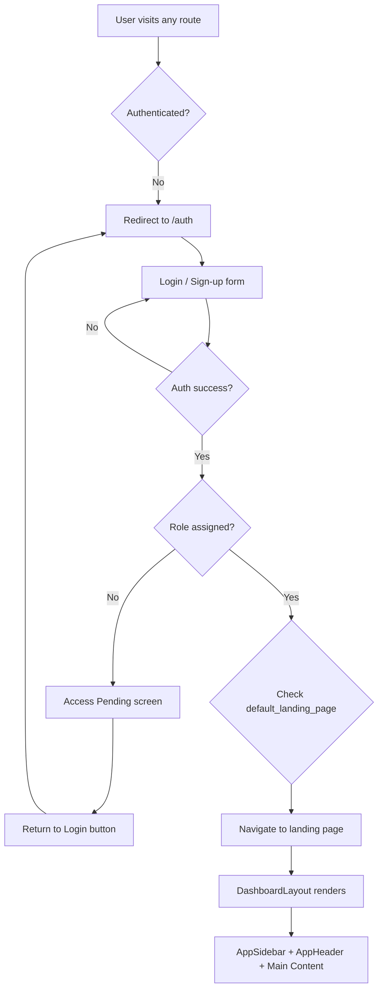
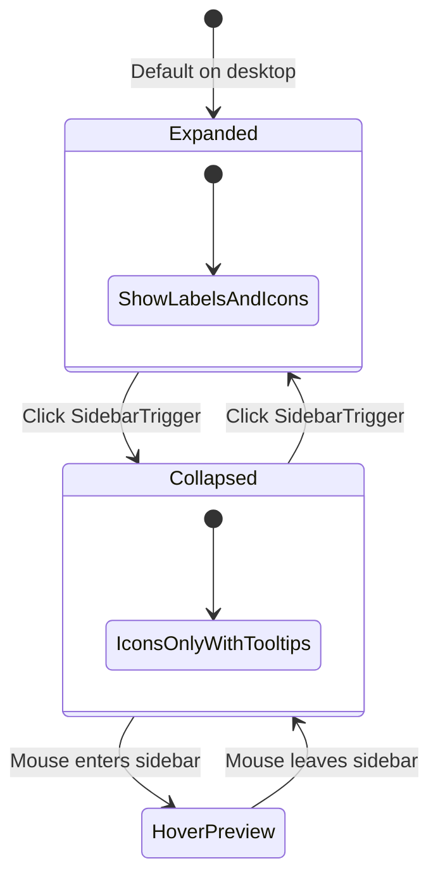
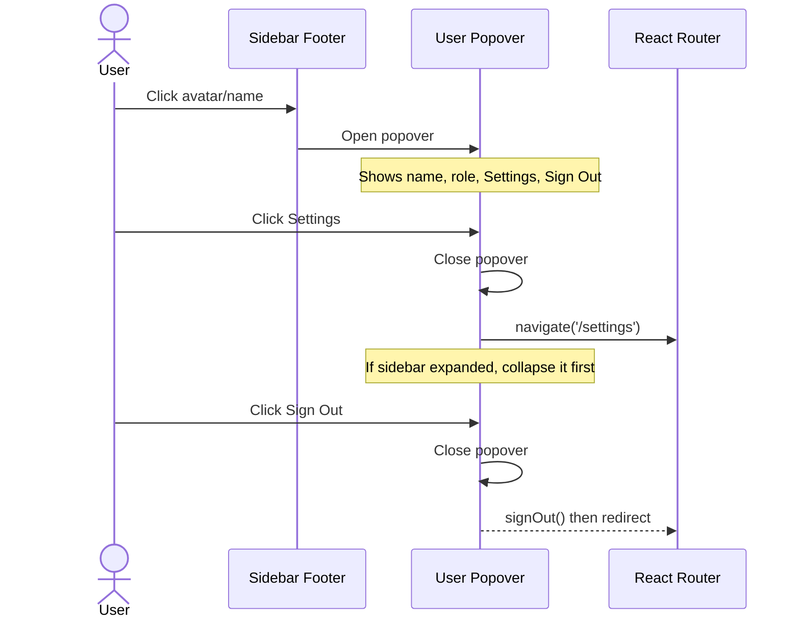
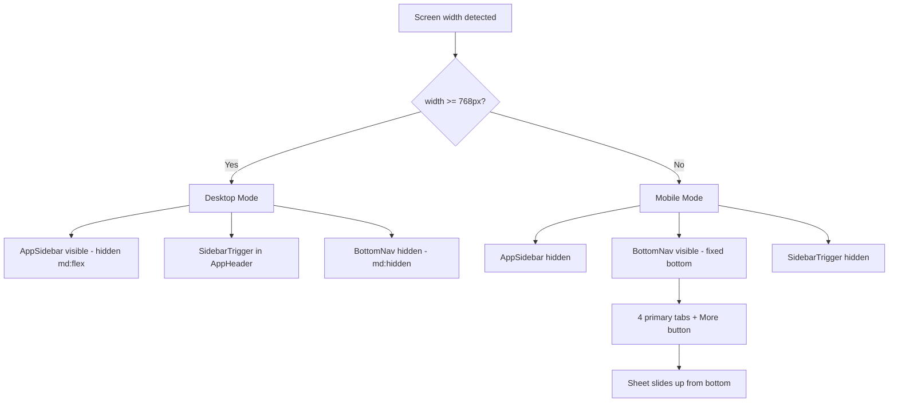
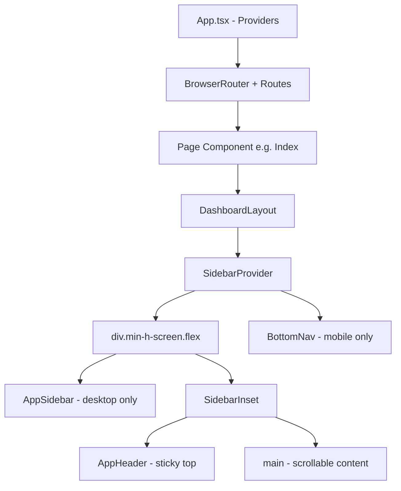
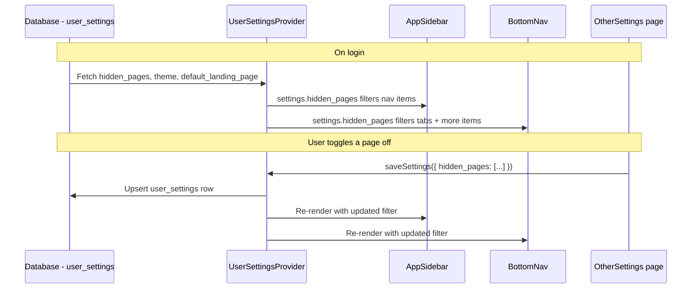
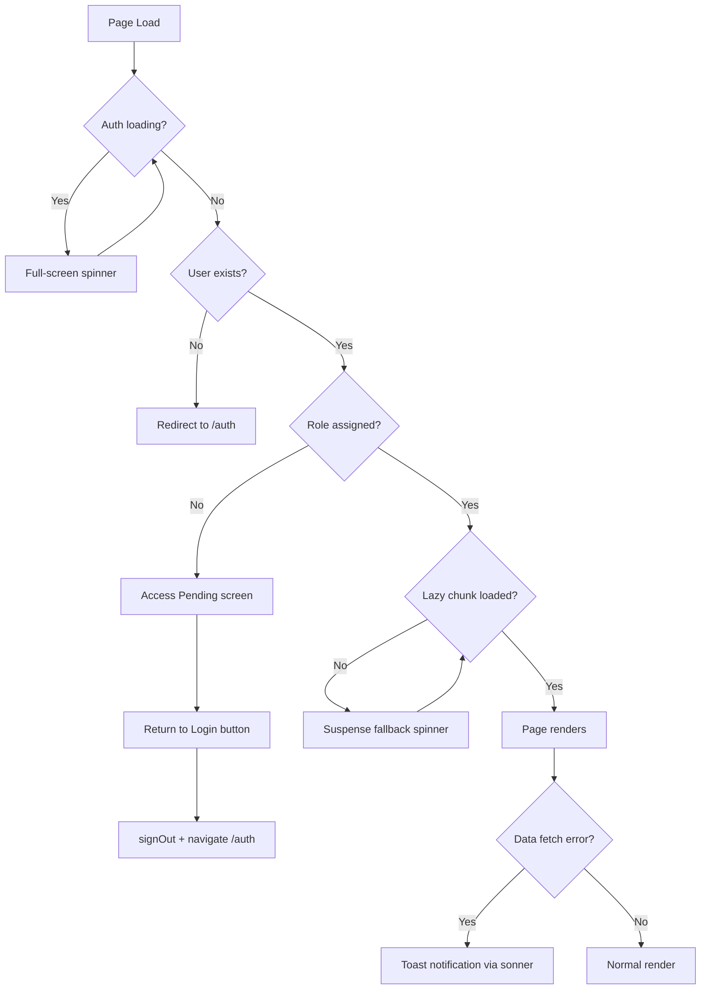

# Kings Bay PMS — Dashboard Flows

Comprehensive documentation of user journeys, navigation states, component integration, responsive behavior, and error handling across the application.

---

## Table of Contents

1. [Project Overview Flow](#1-project-overview-flow)
2. [Sidebar Navigation Flow](#2-sidebar-navigation-flow)
3. [Responsive Behavior Flow](#3-responsive-behavior-flow)
4. [Component Integration Flow](#4-component-integration-flow)
5. [Error States Flow](#5-error-states-flow)

---

## 1. Project Overview Flow

### 1.1 User Journey: Login → Dashboard



### 1.2 Auth Guard Logic

Every protected page is wrapped in `DashboardLayout`, which runs this sequence:

1. `useAuth()` provides `user`, `loading`, `role`, and `signOut`.
2. While `loading` is `true`, a centered spinner is shown.
3. If `!user` after loading, navigate to `/auth`.
4. If `user` exists but `!role`, show **"Access Pending"** with a return-to-login button.
5. Otherwise, render the full dashboard shell.

```tsx
// DashboardLayout.tsx — guard sequence
useEffect(() => {
  if (!loading && !user) {
    navigate('/auth');
  }
}, [user, loading, navigate]);

if (loading) return <Spinner />;
if (!user) return null;
if (!role) return <AccessPending onReturn={handleReturnToLogin} />;
```

### 1.3 Route Map

| Route | Page Component | Auth Required | Notes |
|-------|---------------|---------------|-------|
| `/` | `Index` (Dashboard) | Yes | Default landing page |
| `/auth` | `Auth` | No | Login / sign-up |
| `/front-desk` | `FrontDesk` | Yes | Live room overview |
| `/bookings/new` | `NewBooking` | Yes | Create booking |
| `/bookings` | `Bookings` | Yes | Booking list |
| `/bookings/:id` | `BookingDetails` | Yes | Single booking |
| `/rooms` | `Rooms` | Yes | Room status grid |
| `/housekeeping` | `Housekeeping` | Yes | Cleaning board |
| `/availability` | `AvailabilityCalendar` | Yes | Calendar view |
| `/rate-calendar` | `RateCalendar` | Yes | Rate management |
| `/guests` | `Guests` | Yes | Redirects to `/settings?tab=guests` |
| `/guests/:id` | `GuestDetails` | Yes | Single guest |
| `/reports` | `Reports` | Yes | Financial & occupancy |
| `/settings` | `Settings` | Yes | Supports `?tab=` query param |
| `/properties` | `Properties` | Yes | Admin only |
| `/channels` | `ChannelManager` | Yes | OTA connections |
| `/notifications` | `Notifications` | Yes | Alert center |

---

## 2. Sidebar Navigation Flow

### 2.1 Sidebar States



The sidebar uses `collapsible="icon"` mode from the shadcn Sidebar component:

| State | Width | Labels | Tooltips | Logo Text |
|-------|-------|--------|----------|-----------|
| **Expanded** | ~256px | Visible | Hidden | Property name + type |
| **Collapsed** | ~48px | Hidden | On hover | Crown icon only |
| **Mobile** | Hidden | N/A | N/A | Uses BottomNav instead |

### 2.2 Navigation Items

Main navigation items are defined as a static array filtered by `useUserSettings().hidden_pages`:

```tsx
const mainNavItems = [
  { title: 'Dashboard',     url: '/',              icon: LayoutDashboard },
  { title: 'Front Desk',    url: '/front-desk',    icon: MonitorSmartphone },
  { title: 'New Booking',   url: '/bookings/new',  icon: CalendarPlus },
  { title: 'Bookings',      url: '/bookings',      icon: BookOpen },
  { title: 'Room Status',   url: '/rooms',         icon: BedDouble },
  { title: 'Housekeeping',  url: '/housekeeping',  icon: SprayCan },
  { title: 'Availability',  url: '/availability',  icon: CalendarPlus },
  { title: 'Rate Calendar', url: '/rate-calendar',  icon: DollarSign },
];
```

**Hidden pages filtering:**

```tsx
{mainNavItems
  .filter(item => !userSettings.hidden_pages.includes(item.url))
  .map((item) => { /* render */ })}
```

Users configure visibility in **Settings → Other → Sidebar Pages**.

### 2.3 Active Item Detection

```tsx
const isActive = (path: string) => {
  if (path === '/') return location.pathname === '/';
  if (path === '/bookings') return location.pathname === '/bookings';
  return location.pathname.startsWith(path);
};
```

Key rules:
- `/` — exact match only (prevents always-active)
- `/bookings` — exact match only (prevents highlighting when on `/bookings/new`)
- All others — prefix match (e.g., `/rooms` matches `/rooms/123`)

Active items receive:
- A **3px left accent bar** (`bg-sidebar-ring`)
- **Bold text** (`font-semibold`)
- **Tinted icon** (`text-sidebar-ring`)

### 2.4 User Popover (Footer)



---

## 3. Responsive Behavior Flow

### 3.1 Decision Tree



### 3.2 Desktop vs Mobile Comparison

| Feature | Desktop (≥768px) | Mobile (<768px) |
|---------|------------------|-----------------|
| **Primary nav** | `AppSidebar` (left) | `BottomNav` (fixed bottom) |
| **Collapse toggle** | `SidebarTrigger` in header | N/A |
| **Secondary items** | Always in sidebar | Inside "More" Sheet |
| **Sign out** | User popover in sidebar footer | Inside "More" Sheet |
| **Header trigger** | `hidden md:flex` | Hidden |
| **Bottom padding** | `md:pb-6` | `pb-20` (clear BottomNav) |
| **Property selector** | In `AppHeader` | In `AppHeader` |

### 3.3 Mobile BottomNav Structure

The mobile bottom bar has 4 primary tabs plus a "More" sheet:

```
┌──────────────────────────────────────────┐
│  Dashboard  Availability  Bookings  [+]  More  │
│     ●                              New         │
└──────────────────────────────────────────┘
```

**Primary tabs** (always visible):

```tsx
const primaryTabs = [
  { title: 'Dashboard',    url: '/',             icon: LayoutDashboard },
  { title: 'Availability', url: '/availability',  icon: CalendarDays },
  { title: 'Bookings',     url: '/bookings',      icon: BookOpen },
  { title: 'New',          url: '/bookings/new',   icon: Plus, accent: true },
];
```

**More menu items** (inside bottom Sheet):

```tsx
const moreMenuItems = [
  { title: 'Notifications',    url: '/notifications',  icon: Bell, showBadge: true },
  { title: 'Rooms',            url: '/rooms',           icon: BedDouble },
  { title: 'Housekeeping',     url: '/housekeeping',    icon: SprayCan },
  { title: 'Front Desk',       url: '/front-desk',      icon: MonitorSmartphone },
  { title: 'Channel Manager',  url: '/channels',        icon: Wifi },
  { title: 'Properties',       url: '/properties',      icon: Building2, adminOnly: true },
  { title: 'Settings',         url: '/settings',        icon: Settings },
];
```

The "More" button also shows an **unread notification badge** (real-time via Supabase channel subscription).

### 3.4 Breakpoint Reference

```
  0px ─── 768px ─── 1024px ─── 1600px
   │      │ md       │ lg        │ max-content
   │      │          │           │
   Mobile  Sidebar    Wider       Content cap
   BottomNav appears  padding     at 1600px
```

The `use-mobile.tsx` hook uses `window.matchMedia` at `767px` for JS-level detection:

```tsx
const MOBILE_BREAKPOINT = 768;
const mql = window.matchMedia(`(max-width: ${MOBILE_BREAKPOINT - 1}px)`);
```

---

## 4. Component Integration Flow

### 4.1 Layout Hierarchy



### 4.2 Provider Stack

The app wraps all routes in a provider chain (order matters):

```
QueryClientProvider
  └─ ThemeProvider (next-themes)
       └─ AuthProvider (useAuth context)
            └─ PropertyProvider (useProperty context)
                 └─ UserSettingsProvider (useUserSettings context)
                      └─ TooltipProvider
                           └─ BrowserRouter
                                └─ Suspense (lazy loading)
                                     └─ Routes
```

### 4.3 Data Flow: Settings → Sidebar



### 4.4 Key Component Files

| Component | File | Purpose |
|-----------|------|---------|
| `DashboardLayout` | `src/components/layout/DashboardLayout.tsx` | Auth guard + shell |
| `AppSidebar` | `src/components/layout/AppSidebar.tsx` | Desktop sidebar nav |
| `AppHeader` | `src/components/layout/AppHeader.tsx` | Sticky header bar |
| `BottomNav` | `src/components/layout/BottomNav.tsx` | Mobile bottom nav |
| `PropertySelector` | `src/components/layout/PropertySelector.tsx` | Property dropdown |
| `NotificationBell` | `src/components/layout/NotificationBell.tsx` | Header bell icon |
| `PropertyBadge` | `src/components/layout/PropertyBadge.tsx` | Property indicator |

---

## 5. Error States Flow

### 5.1 Error State Diagram



### 5.2 Loading States

| Scenario | UI | Component |
|----------|-----|-----------|
| **Auth checking** | Centered spinner + "Loading..." | `DashboardLayout` |
| **Lazy page loading** | Centered spinner (no text) | `PageLoader` in `App.tsx` |
| **Data fetching** | Component-level skeletons | Individual pages |
| **Settings saving** | Optimistic update + error toast | `useUserSettings` |

### 5.3 Auth Loading Spinner

```tsx
// Shown while useAuth().loading is true
<div className="min-h-screen flex items-center justify-center bg-background">
  <div className="flex flex-col items-center gap-4">
    <div className="h-8 w-8 animate-spin rounded-full border-4 border-primary border-t-transparent" />
    <p className="text-muted-foreground">Loading...</p>
  </div>
</div>
```

### 5.4 Access Pending Screen

Shown when `user` exists but `role` is `null` (not yet assigned by admin):

```tsx
<div className="min-h-screen flex items-center justify-center bg-background p-4">
  <div className="text-center space-y-4 max-w-md">
    <h2 className="text-2xl font-semibold text-foreground">Access Pending</h2>
    <p className="text-muted-foreground">
      Your account has been created but you haven't been assigned a role yet.
      Please contact an administrator to get access to the system.
    </p>
    <Button variant="outline" onClick={handleReturnToLogin}>
      <LogIn className="h-4 w-4" />
      Return to login
    </Button>
  </div>
</div>
```

### 5.5 Lazy Load Fallback

All page components use `React.lazy()` with a shared Suspense boundary:

```tsx
// App.tsx
const Index = lazy(() => import("./pages/Index"));
// ... all pages lazy-loaded

<Suspense fallback={<PageLoader />}>
  <Routes>
    <Route path="/" element={<Index />} />
    {/* ... */}
  </Routes>
</Suspense>
```

---

## Appendix: Role-Based Visibility

| Element | Admin | Manager | Front Desk | Viewer |
|---------|-------|---------|------------|--------|
| Properties nav item | Yes | No | No | No |
| Properties in BottomNav | Yes | No | No | No |
| Settings (all tabs) | Yes | Yes | Limited | Read-only |
| Danger Zone | Yes | No | No | No |
| Booking CRUD | Yes | Yes | Yes | Read-only |
| Guest delete | Yes | No | No | No |

---

*Generated from codebase analysis — Kings Bay PMS*
